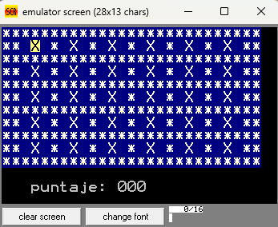
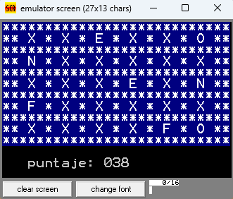
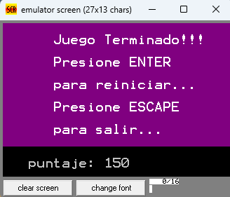

# Assembly 8086 game

After clone, run the emulator emu8086v408r and open this file main.asm

## keyboard keys

- UP = y
- DOWN = n
- LEFT = g
- RIGHT = j
- UNCOVER_LETTER = h

### Initial board

### Some uncover letters board

### Final board - win when uncover all letters

### Solution

|||||||
|-|-|-|-|-|-|
|A|H|E|K|B|O|
|N|C|J|G|I|D|
|G|M|A|E|K|N|
|F|M|H|L|C|D|
|B|J|I|L|F|O|
